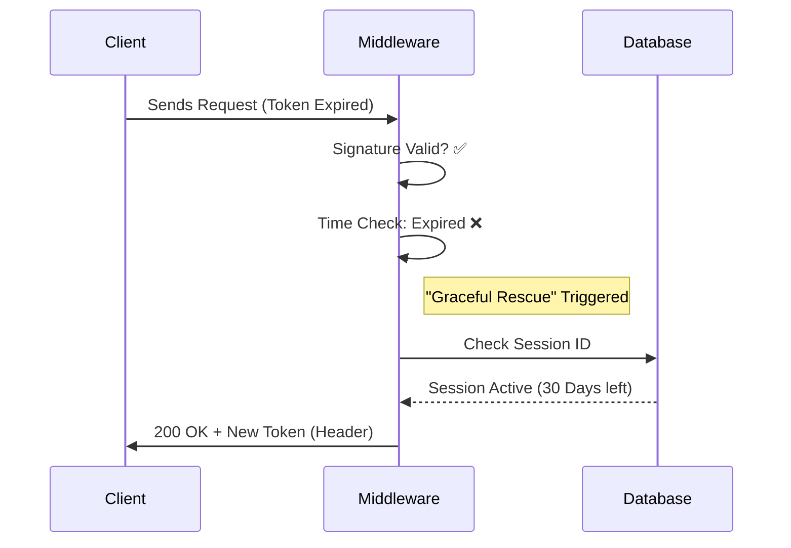

# 🛡️ ZenAuth

> **Stateful Security, Stateless Speed.**  
> An enterprise-grade identity management library featuring "Graceful Token Rotation," Device Fingerprinting, and Sliding Window sessions.

[](https://www.npmjs.com/package/@namra_ace/zen-auth)


---

## 💡 Why ZenAuth?

In modern web development, you typically have to choose between **Security** (short-lived JWTs) and **User Experience** (long-lived sessions).  

**ZenAuth gives you both.** It uses a **Hybrid Architecture** to maintain security without forcing users to log in repeatedly.

| Feature         | Standard JWT                | ZenAuth                     |
|------------------|-----------------------------|-----------------------------|
| **Revocation**   | ❌ Impossible until expiry  | ✅ **Instant** (DB Backed)  |
| **Performance**  | ✅ High (Stateless)         | ✅ **High** (Redis Caching) |
| **UX**           | ❌ Hard Logout on expiry    | ✅ **Graceful Auto-Rotation** |
| **Device Mgmt**  | ❌ None                     | ✅ **Active Sessions View** |

---

## 📦 Installation

Install ZenAuth via npm:

```bash
npm install @namra_ace/zen-auth
```

---

## 🚀 Quick Start

### 1. Initialize

ZenAuth is database-agnostic. Below is a standard production setup using Redis:

```typescript
import { ZenAuth, RedisStore } from '@namra_ace/zen-auth';
import { createClient } from 'redis';

// 1. Connect to Redis
const redis = createClient();
await redis.connect();

// 2. Initialize Auth Engine
const auth = new ZenAuth({
    secret: process.env.JWT_SECRET || 'super-secret',
    store: new RedisStore(redis),
    sessionDuration: 30 * 24 * 60 * 60, // 30 Days (Sliding Window)
    tokenDuration: '15m',               // Rotate token every 15 mins
    smtp: {                             // Optional: For Email OTP
        host: 'smtp.example.com',
        auth: { user: '...', pass: '...' }
    }
});
```

---

### 2. Login (Capture Device Info)

Pass the request object (`req`) so ZenAuth can fingerprint the device (IP/User-Agent).

```typescript
import express from 'express';
const app = express();

app.post('/api/login', async (req, res) => {
    // ... validate user credentials first ...
    const userId = 'user_123'; 

    // Create Session & Token
    const { token, sessionId } = await auth.login({ id: userId, role: 'admin' }, req);

    res.json({ token });
});
```

---

### 3. Protect Routes (Middleware)

Use the included `gatekeeper` middleware to secure endpoints. It automatically handles Graceful Expiration.

```typescript
import { gatekeeper } from '@namra_ace/zen-auth/middleware';

app.get('/api/profile', gatekeeper(auth), (req, res) => {
    // If token was rotated, the new one is in res.headers['x-zen-token']
    res.json({ message: `Hello User ${req.user.id}` });
});
```

---

## 🔌 Database Adapters

ZenAuth works with any database. Import the specific adapter you need.

### Redis (Recommended for Speed)

Uses Secondary Indexing (Sets) to map Users ↔ Sessions for O(1) lookups.

```typescript
import { RedisStore } from '@namra_ace/zen-auth/adapters';
// Requires 'redis' package installed
const store = new RedisStore(redisClient);
```

### PostgreSQL (Persistent)

Requires a table with columns: `sid` (text), `sess` (json), `expired_at` (timestamp).

```typescript
import { PostgresStore } from '@namra_ace/zen-auth/adapters';
// Requires 'pg' pool
const store = new PostgresStore(pool, 'auth_sessions_table');
```

### MongoDB

Stores sessions as documents. Good for no-setup environments.

```typescript
import { MongoStore } from '@namra_ace/zen-auth/adapters';
// Requires 'mongoose' connection
const store = new MongoStore(mongoose.connection.collection('sessions'));
```

---

## 🧠 Advanced Features

### 📱 Device Management Dashboard

Allow users to see all their logged-in devices and remotely log them out (like Netflix/Google).

```typescript
// GET /api/devices
app.get('/api/devices', gatekeeper(auth), async (req, res) => {
    // Returns: [{ device: { ip: '...', userAgent: 'Chrome' }, loginAt: '...' }]
    const sessions = await auth.getActiveSessions(req.user.id);
    res.json(sessions);
});

// POST /api/devices/logout-all
app.post('/api/devices/logout-all', gatekeeper(auth), async (req, res) => {
    await auth.logoutAll(req.user.id);
    res.json({ success: true, message: "Logged out of all other devices" });
});
```

---

### 📧 Passwordless Login (OTP)

Built-in support for generating and verifying Email One-Time-Passwords.

```typescript
// 1. Send Code
app.post('/auth/send-code', async (req, res) => {
    await auth.sendOTP(req.body.email);
    res.send('Code sent!');
});

// 2. Verify & Login
app.post('/auth/verify-code', async (req, res) => {
    const { valid } = await auth.verifyOTP(req.body.email, req.body.code);
    
    if (valid) {
        const { token } = await auth.login({ email: req.body.email }, req);
        res.json({ token });
    } else {
        res.status(401).send('Invalid Code');
    }
});
```

---

## 🏗️ Architecture: "Graceful Expiration"

This is the core problem ZenAuth solves.

**Scenario:** User leaves a tab open for 20 minutes. The 15-minute JWT expires.  

- **Standard Library:** Request fails (401). User is forced to log in again. 😡  
- **ZenAuth:** Middleware catches the expiry error, checks the database, and issues a new token if the session is still valid.



---

## 🧪 Security & Testing

This library is 100% covered by tests using Vitest.

- ✅ **Replay Protection:** OTPs are deleted immediately after use.
- ✅ **Tamper Proofing:** Tokens signed with invalid secrets are rejected immediately.
- ✅ **Lazy Cleanup:** Expired sessions are automatically cleaned up from the user index during read operations to prevent memory leaks.

---